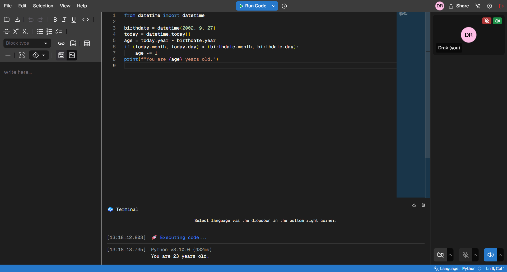

### ☐ SyncCode
SyncCode is a collaborative coding platform with real-time video integration, enabling seamless teamwork, code sharing, and remote pair programming.

<p align="center">
  
</p>

- **Real-time Collaboration**  
  Collaborate on code with live cursor sharing, synchronized highlighting, and follow mode to enhance team productivity and visibility.

- **Shared Terminal**  
  Execute code and view results in real time, supporting over 80 programming languages for versatile development workflows.

- **Live Preview**  
  Instantly preview UI changes with built-in support for popular libraries such as Tailwind CSS and others, streamlining frontend development.

- **GitHub Integration**  
  Seamlessly save and access your code directly from GitHub repositories, enabling efficient version control and project management.

- **Shared Notepad**  
  Take collaborative notes in real time with rich text and Markdown support, ideal for brainstorming and documentation.

- **Video & Voice Chat**  
  Communicate with your team using integrated video and voice chat, ensuring smooth coordination during collaborative sessions.

### ☐ Toolkit

#### Frontend
- **Framework:** Next.js, TypeScript
- **Styling:** Tailwind CSS, shadcn/ui
- **Editor:** Monaco Editor, Sandpack (live preview)
- **Collaboration:** Socket.IO Client, simple-peer (WebRTC)
- **Notepad:** MDXEditor
- **Forms:** React Hook Form + Zod

#### Backend
- **Runtime:** Node.js, TypeScript
- **Real-time:** Socket.IO (WebSockets.js server)

#### Testing
- **E2E:** Playwright
- **Unit:** Jest
- **Security:** CodeQL

#### Code Quality
- **Linting:** ESLint
- **Formatting:** Prettier
- **Git Hooks:** Husky
- **Commit Linting:** commitlint

#### Build & DevOps
- **Monorepo:** Turborepo
- **CI/CD:** GitHub Actions
- **Deployment:** Vercel (frontend), Render (backend)

#### Monitoring & Analytics
- **Error Tracking:** Sentry
- **Web Analytics:** Vercel Analytics, Cloudflare Web Analytics
- **Uptime & Status:** Better Stack

#### External Services
- **Code Execution:** Piston
- **Repository Management:** GitHub REST API


### ☐ Project Structure
``` Java
    SyncCode
    ├── apps/                    # Application packages for frontend and backend services
    │   ├── client/              # Frontend Next.js application
    │   │   ├── public/          # Static assets (images, fonts, etc.)
    │   │   ├── src/             # Source code for the frontend
    │   │   │   ├── app/         # Next.js app router pages and API routes
    │   │   │   ├── components/  # Reusable React components
    │   │   │   ├── hooks/       # Custom React hooks for state and logic management
    │   │   │   └── lib/         # Utility functions and shared services
    │   │   └── tests/           # Frontend test suite (Playwright)
    │   └── server/              # Backend Socket.IO server
    │       ├── src/             # Source code for the backend
    │       │   ├── service/     # Backend business logic and services
    │       │   └── utils/       # Utility functions for backend operations
    │       └── tests/           # Backend test suite (Jest)
    ├── docs/                    # Documentation assets and guides
    ├── packages/                # Shared packages across applications
    │   └── types/               # Shared TypeScript types and interfaces
    ├── scripts/                 # Build, deployment, and maintenance scripts
    ├── package.json             # Root package.json for workspace dependencies
    └── pnpm-workspace.yaml      # PNPM workspace configuration for monorepo management

```

### ☐ Installation
1. **Prerequisites**

- [Node.js](https://nodejs.org/en/) (v18 or higher)
- [pnpm](https://pnpm.io) (v6 or higher)

If pnpm is not installed, run:
```bash
    npm install -g pnpm
```

2. **Clone**

```bash
    git clone https://github.com/harshkunz/SyncCode
    cd SyncCode

    pnpm install
```

3. **Environment setup**

Create apps/client/.env

```bash
    BETTERSTACK_API_KEY=
    SENTRY_AUTH_TOKEN=
    GITHUB_CLIENT_SECRET_PROD=
    GITHUB_CLIENT_SECRET_DEV=
    SENTRY_SUPPRESS_TURBOPACK_WARNING="1"
    TURBO_TEAM=
    TURBO_TOKEN=
```
Create apps/server/.env

```bash
    CLIENT_URL=
    SERVER_URL=
    GITHUB_CLIENT_ID_PROD=
    GITHUB_CLIENT_SECRET_PROD=
```

4. **Run Server**

```bash
    pnpm dev        # Both server

    pnpm --filter client dev
    pnpm --filter server dev
```

The application will be available at:

- Frontend: http://localhost:3000
- Backend: http://localhost:3001


### ☐ Test
Run all frontend E2E tests from the root or client workspace:

```bash
    pnpm test:client            # Execute all frontend E2E tests
    pnpm test:client:ui         # Run tests in UI mode
    pnpm test:client:debug      # Debug frontend tests
    pnpm test:client:report     # View test report

    # Run tests only in the client workspace
    pnpm --filter client test:client
```

Run backend tests from the root or server workspace:

```bash
    pnpm test:server            # Execute backend tests against local server
    pnpm test:server:remote     # Run backend tests against remote server
    pnpm test:server:watch      # Run backend tests in watch mode (local server)

    # Run tests only in the server workspace
    pnpm --filter server test:server
```

### ☐ Deployment
Build the entire project with Turborepo caching:
```bash
    pnpm build
    or
    pnpm build:client           # Build frontend
    pnpm build:server           # Build backend
```

Linting and Formatting

```bash
    pnpm lint                   # Run ESLint checks
    pnpm lint:fix               # Fix ESLint issues
    pnpm format                 # Check formatting
    pnpm format:fix             # Fix formatting issues
```


> Run scripts (without Turborepo caching):

```bash
    # Frontend specific
    pnpm --filter client dev
    pnpm --filter client build
    pnpm --filter client test:e2e

    # Backend specific
    pnpm --filter server dev
    pnpm --filter server build
    pnpm --filter server test:socket
```

### ☐ Contributing
Open to contributions!
- Fork the repository  
- Create a new branch (`git checkout -b feature-name`)  
- Commit your changes (`git commit -m 'Add feature'`)  
- Push to the branch (`git push origin feature-name`)  
- Create a Pull Request
